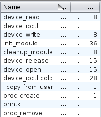
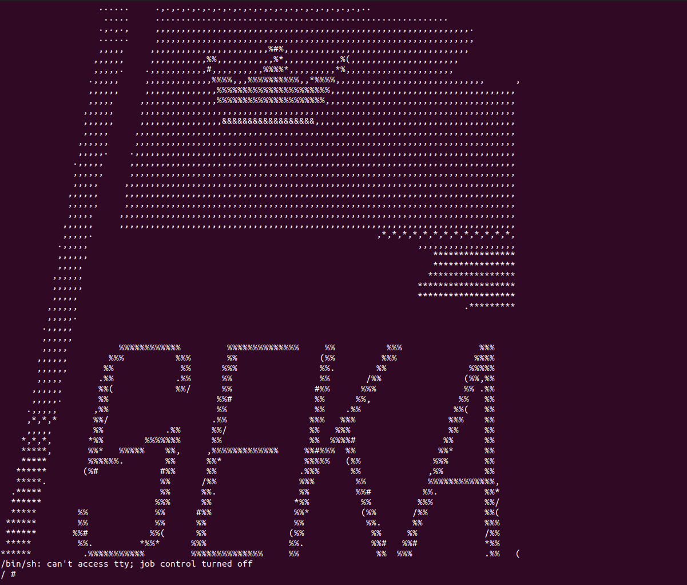

# Guardians of the Kernel

## Description
Unlike the usual rev challenge this challenge was one level lower, targeting the kernel, where our main goal was reversing a minimalistic kernel.

# Background
Before embarking on this exhilarating quest, let's familiarize ourselves with some vital concepts:
- The **bzImage** compresses the Linux kernel image, the brain and core of your computer's operation.
- **initramfs** offers a temporary file system equipped with essentials, drivers, and tools for mounting the root file system. Think of it as the setup crew before the main event.

Now that we have an idea on what we already have, we can start our analysis following these steps :

### Unleashing the Power of initramfs
Kickstart your journey by extracting the initramfs using a script like this:
```bash
#!/bin/sh

mkdir initramfs
cd initramfs
cp ../initramfs.cpio.gz .
gunzip ./initramfs.cpio.gz
cpio -idm < ./initramfs.cpio
rm initramfs.cpio
```
The above script will generate a folder that will make you find yourself surrounded by files that boot up when your kernel image springs to life.

### Analyze the file system
The first thing, I always do when analyzing the file system is taking a look into the [init](./initramfs/init) script.

Reading thro the script we find an interesting module being inserted `flag_checker`.

#### Quick Note
Ever heard of kernel modules? They're like binary companions, but they flex their muscles in the realm of the kernel (ring 0). This is different from regular binaries that operate in the user mode (ring 3).

With that being said, let fire Ghidra and take a look into our kernel module.



Our heroes here are `read`, `write`, and the enchanting `ioctl`. But most of the fun is happening in the ioctl function.

```c
undefined8 device_ioctl(undefined8 fd,int request,undefined8 arg)

{
  uint uVar1;
  uint uVar2;
  uchar *buf_ptr;
  undefined8 uVar3;
  long lVar4;
  
  if (request == 0x7001) {
    if (layers[1] != 0) {
      lVar4 = _copy_from_user(buffer,arg,7);
      if (lVar4 != 0) {
        return 0xfffffffffffffff2;
      }
      buffer[7] = '\0';
      buf_ptr = buffer;
      do {
        if (9 < (byte)(*buf_ptr - 48)) {
          buffer[7] = '\0';
          return 0;
        }
        buf_ptr = buf_ptr + 1;
      } while (buf_ptr != buffer + 7);
      uVar1 = (uint)(buffer._0_4_ * 0x193482ba) >> 15 | buffer._0_4_ * 0x5740000;
      uVar2 = (uint)buffer[4] ^ (uint)buffer[6] << 16 ^ (uint)buffer[5] << 8;
      uVar1 = (uVar2 * 0x193482ba >> 0xf | uVar2 * 0x5740000) * 0x59d87c3f ^
              (uVar1 * -0x3c1e0800 | uVar1 * 0x59d87c3f >> 21) * 7 + 0x47c8ac62;
      uVar1 = (uVar1 >> 0x10 ^ uVar1 ^ 7) * 0x764521f9;
      uVar1 = (uVar1 ^ uVar1 >> 0xd) * -1817436554;
      if ((uVar1 ^ uVar1 >> 0x10) == 261736481) {
        uVar3 = device_ioctl.cold();
        return uVar3;
      }
    }
  }
  else if (request == 0x7002) {
    if (layers[2] != 0) {
      lVar4 = _copy_from_user(buffer,arg,12);
      if (lVar4 != 0) {
        return 0xfffffffffffffff2;
      }
      do {
        buffer[lVar4] = buffer[lVar4] + ~(byte)lVar4 * buffer[lVar4 + 1];
        lVar4 = lVar4 + 1;
      } while (lVar4 != 0xc);
      if (((CONCAT17(buffer[7],
                     CONCAT16(buffer[6],CONCAT15(buffer[5],CONCAT14(buffer[4],buffer._0_4_)))) ==
            0x788c88b91d88af0e) && (buffer._8_4_ == 0x7df311ec)) && (buffer[12] == '\0')) {
        printk(&DAT_0010032b);
        return 1;
      }
    }
  }
  else {
    if (request != 0x7000) {
      printk(&DAT_00100342);
      return 0;
    }
    lVar4 = _copy_from_user(buffer,arg,6);
    if (lVar4 != 0) {
      return 0xfffffffffffffff2;
    }
    if ((buffer._0_4_ == 0x414b4553) && (CONCAT11(buffer[5],buffer[4]) == 0x7b49)) {
      printk(&DAT_001002f6);
      layers[1] = 1;
      return 1;
    }
  }
  return 0;
}
```
Jokes aside let's get serious now. After Reading thro the code a bit we can see that this `ioctl` is defining and accepting only 3 types of requests:
- **0x7000**: it checks if our arg starts with `SEKAI{` and then unlocking layer 1.
- **0x7001**: it checks first if we did unlock layer 1, and then it will expect a 7 digit number which can be easily bruteforced and if satisfied it will unlock layer 2.
- **0x7002**: it checks if we did unlock layer 2, and then it will do some checks that could be either reverse, debugged or solved directly using z3.

And now that we have an idea how this module and what it does, we can start building our attack to get the flag, following these steps :
1. Run the kernel image with [qemu](./qemu-run.sh).
2. Make a C binary that will communicated with the module via ioctl, unlock the first layer and bruteforce the number to unlock the second layer.
3. Solve the second layer using z3.


## First Step
To emulate the kernel, we can use the following script :
```bash
#!/bin/sh

/usr/bin/qemu-system-x86_64 \
    -m 64M \
    -kernel bzImage \
    -initrd initramfs.cpio.gz \
    -nographic \
    -monitor none \
    -no-reboot \
    -cpu kvm64,+smep,+smap \
    -append "console=ttyS0 nokaslr quiet" $@

```
The reason behind the `$@` in the end, is to add `-s -S` in case I have to debug the module.

If the script is running correctly, you should be able to see smth like this :


And now if we inspect the running modules using : `lsmod`

We should be able to see smth like this :

```
/ # lsmod
flag_checker 16384 0 - Live 0xffffffffc0000000 (O)
```
Which means that our module is running.

## Second Step
Now that we have our kernel running, we have to find a way to interact with the module and to do that, I made a script that uses the ioctl function in C, however now we have to find a way to run it in the kernel environment and to do that, you can either start a shared point with qemu and then anything you paste there can be accessible by both your localhost and the running kernel, or you can use my l33t way of doing stuff.
1. Compile the binary in your local host using musl-gcc and with `-static` flag cuz the kernel doesn't have a libc.
2. Gzip it. (To make it smaller)
3. Base64 encode the file and copy the base64.
4. Pipe it into base64 in the kernel and decode it into foo.gz : `echo "Base64value..." | base64 -d > foo.gz`
5. Decompress it using gzip again
6. Run it, and wait a few seconds, and u will get your layer 1.

The above steps could be samurized in this script :
```bash
#!/bin/bash

musl-gcc interact.c -o interact -static
gzip interact
base64 interact.gz
```
And the solve script is the following :
```c
#include <stdio.h>
#include <stdlib.h>
#include <fcntl.h>
#include <unistd.h>
#include <sys/ioctl.h>
#include <string.h>

void intToPaddedString(int number, char *num_str, int width) {
    sprintf(num_str, "%d", number);

    int length = strlen(num_str);
    int padding = width - length;

    if (padding > 0) {
        memmove(num_str + padding, num_str, length + 1);
        for (int i = 0; i < padding; i++) {
            num_str[i] = '0';
        }
    }
}

int main(int argc, char **argv) {
    int fd = open("/proc/Flag-Checker", O_RDWR);
    if (fd < 0) {
        perror("Failed to open file");
        return 1;
    }

    // set layer to true
    unsigned long request = 0x7000;
    int result = ioctl(fd, request, "SEKAI{BRUH}");
        if (result != 0)
            printf("The result is : %d\n", result);
        else
            printf("Wrong !");

    // bruteforce the layer one
    request = 0x7001;
    int i = 0;
    while (i < 9999999)
    {
        char num_str[8];
        intToPaddedString(i, num_str, 7);
        int result = ioctl(fd, request, num_str);
        if (result != 0)
        {
            printf("The num is : %d\n", i);
            break;
        }
        i++;
    }
    close(fd);
    return 0;
}
```

## Third Layer
To solve this piece of code:

```c
do {
    buffer[lVar4] = buffer[lVar4] + ~(byte)lVar4 * buffer[lVar4 + 1];
    lVar4 = lVar4 + 1;
} while (lVar4 != 0xc);

if (((CONCAT17(buffer[7],
              CONCAT16(buffer[6],CONCAT15(buffer[5],CONCAT14(buffer[4],buffer._0_4_)))) ==
     0x788c88b91d88af0e) && (buffer._8_4_ == 0x7df311ec)) && (buffer[12] == '\0')) {
    printk(&DAT_0010032b);
    return 1;
}
```

I used the following script

```python
from z3 import *

s = Solver()

buffer = [BitVec(f'{i}', 8) for i in range(13)]
new_buffer = [BitVec(f'new{i}', 8) for i in range(13)]

for i in range(12):
    not_i = ~BitVecVal(i, 8)
    new_buffer[i] = buffer[i] + buffer[i + 1] * not_i

for i in range(12):
    s.add(And(buffer[i] >= 0x20, buffer[i] <= 0x7e))

s.add(Concat(new_buffer[7], new_buffer[6], new_buffer[5], new_buffer[4], new_buffer[3], new_buffer[2], new_buffer[1], new_buffer[0]) == 0x788C88B91D88AF0E)
s.add(Concat(new_buffer[11], new_buffer[10], new_buffer[9], new_buffer[8]) == 0x7DF311EC)
s.add(new_buffer[12] == 0)

second_part = ""
if s.check() == sat:
    m = s.model()
    for i in range(13):
        second_part += chr(int(str(m[buffer[i]])))
    print(second_part)
```
We can break it down into the following:

1. The loop in the C code is simulated using the following Python code:
```python
new_buffer = [BitVec(f'new{i}', 8) for i in range(13)]
for i in range(12):
    not_i = ~BitVecVal(i, 8)
    new_buffer[i] = buffer[i] + buffer[i + 1] * not_i
```

This loop calculates the values for the new_buffer array based on the operations in the C code loop.

2. The conditions involving the buffer values are translated using Z3 constraints:

```python
for i in range(12):
    s.add(And(buffer[i] >= 0x20, buffer[i] <= 0x7e))
s.add(Concat(new_buffer[7], new_buffer[6], new_buffer[5], new_buffer[4], new_buffer[3], new_buffer[2], new_buffer[1], new_buffer[0]) == 0x788C88B91D88AF0E)
s.add(Concat(new_buffer[11], new_buffer[10], new_buffer[9], new_buffer[8]) == 0x7DF311EC)
s.add(new_buffer[12] == 0)
```
These constraints ensure that the values of buffer and new_buffer satisfy the conditions specified in the C code.

3. We are using the check method by z3 to make sure we found a valid solution:

```python
if s.check() == sat:
```
This checks if there is a solution that satisfies the specified constraints.

If a satisfying solution is found, the script extracts the character values from the model and constructs the "second_part" string:

```python
    m = s.model()
    for i in range(13):
        second_part += chr(int(str(m[buffer[i]])))
```
and just like Magic we get our second part and a good looking, challenge solved, on the screen ! 
